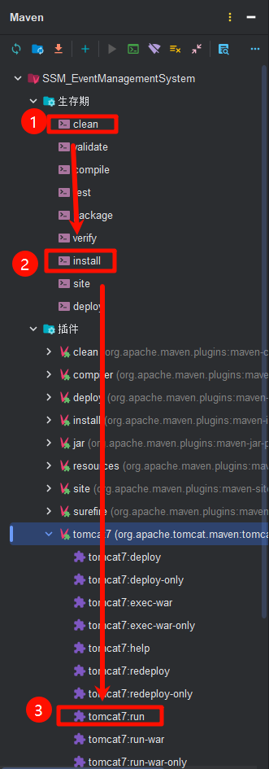
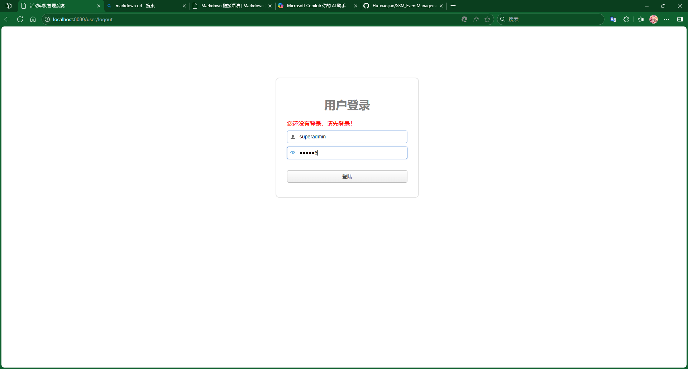
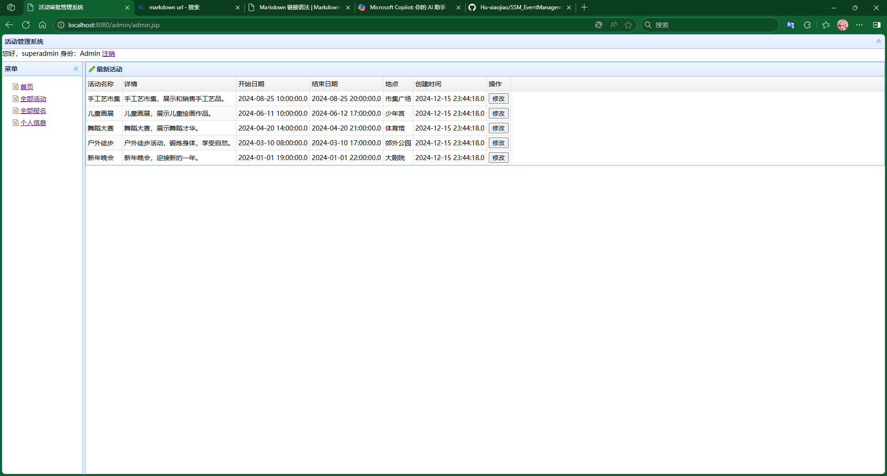
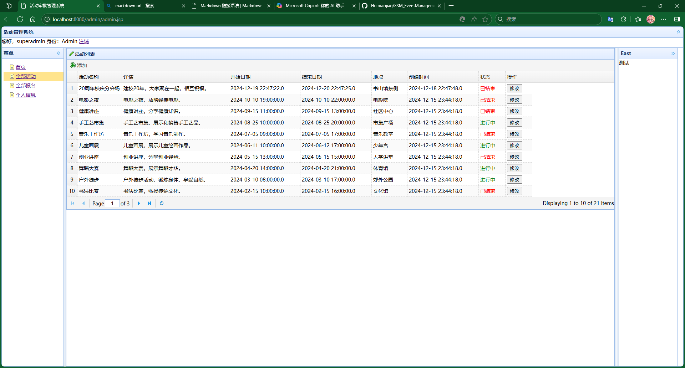
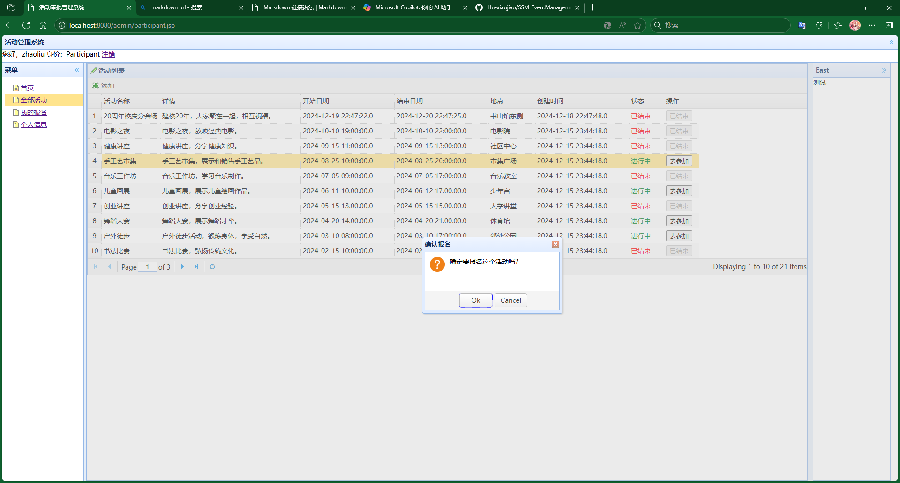

# SSM_EventManagementSystem
一种基于SSM（SpringMVC+Spring+Mybatis）+ jQuery 框架的 活动审批管理系统

## 目录

- [介绍](#介绍)
- [技术栈](#技术栈)
- [安装](#安装)
- [配置](#配置)
- [运行](#运行)
- [使用](#使用)
- [测试](#测试)
- [常见问题](#常见问题)
- [贡献指南](#贡献指南)
- [许可证](#许可证)
- [致谢](#致谢)

## 介绍

- 背景：三亚学院2022级大三上半学期 动态网站开发 课程期末大作业
- 主要功能：活动创建、删除、修改、查询，用户可以报名参加活动，管理员可以创建活动。
- 目标用户：暂无

## 技术栈

##### 后端：
- SpringMVC+Spring+Mybatis SSM框架
- jdk Amazon Corretto 1.8.0_432

##### 前端：
- jQuery 框架
- EasyUi UI框架（随便选的）
- 使用 JSP 进行服务端渲染，不涉及前后端分离

##### 数据库：
- MySQL 8.0.30 Server

## 安装

1. 克隆仓库：
    ```sh
    git clone https://github.com/Hu-xiaojiao/SSM_EventManagementSystem.git
    ```
2. 使用 idea 打开项目文件夹

3. 选择 JDK 1.8
4. 进入 [pom.xml](pom.xml) 文件，安装内部全部依赖
5. 使用 idea 自带的 maven，先进行 clean，然后 install
6. 使用 [eventmanagementsystem.sql](eventmanagementsystem.sql) 导入数据库数据



## 配置


修改 [jdbc.properties](src/main/resources/jdbc.properties) 为自己的数据库访问

## 运行

使用 maven 中的 tomcat7:run 命令运行 Tomcat 服务器后，

访问默认地址：<http://localhost:8080>

## 使用

简要介绍如何使用项目的主要功能，可以包含一些截图或使用示例。

登录页面


首页 - Admin


全部活动 - Admin


报名 - Participant
## 测试

可以编辑 [UserLoginTest.java](src/test/java/com/evenetmangement/UserLoginTest.java) 或者在其包内任意新建文件进行单元测试。

## 许可证

### MIT License

Copyright (c) [2024] [Huxiaojiao]

Permission is hereby granted, free of charge, to any person obtaining a copy
of this software and associated documentation files (the "Software"), to deal
in the Software without restriction, including without limitation the rights
to use, copy, modify, merge, publish, distribute, sublicense, and/or sell
copies of the Software, and to permit persons to whom the Software is
furnished to do so, subject to the following conditions:

The above copyright notice and this permission notice shall be included in all
copies or substantial portions of the Software.

THE SOFTWARE IS PROVIDED "AS IS", WITHOUT WARRANTY OF ANY KIND, EXPRESS OR
IMPLIED, INCLUDING BUT NOT LIMITED TO THE WARRANTIES OF MERCHANTABILITY,
FITNESS FOR A PARTICULAR PURPOSE AND NONINFRINGEMENT. IN NO EVENT SHALL THE
AUTHORS OR COPYRIGHT HOLDERS BE LIABLE FOR ANY CLAIM, DAMAGES OR OTHER
LIABILITY, WHETHER IN AN ACTION OF CONTRACT, TORT OR OTHERWISE, ARISING FROM,
OUT OF OR IN CONNECTION WITH THE SOFTWARE OR THE USE OR OTHER DEALINGS IN THE
SOFTWARE.

## 作者
[Huxiaojiao 胡小椒](https://github.com/Hu-xiaojiao)
QQ: 3192029612 欢迎骚扰